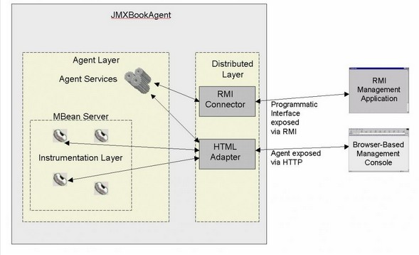

##JMX进阶

###1、RMI连接器
架构图

####1.1 原理

	service:jmx:rmi://127.0.0.1:5000/jndi/rmi://127.0.0.1:1099/rmiConnector

* **service:jmx**, JMX URL的标准前缀，所有的JMX URL都必须以该字符串开头。
* **rmi**:, 连接服务器的传输协议，对于此URL来讲是使用RMI来进行传输的。
* **127.0.0.1:5000**, 表示连接服务器的IP和端口, 该部分是一个可选项，可以被省略掉。如果省略掉了，使用的是本机随机的一个端口号。
* **/jndi/rmi://127.0.0.1:1099/rmiConnector**, 表示连接服务器的路径，具体含义取决于前面的传输协议。比如该URL中的这串字符串就代表着该连接服务器的stub, 该stub是使用jndi api绑定在/jndi/rmi://127.0.0.1:1099/rmiConnector上。

代码示例：

	//1.注册NamingService MBean
    ObjectName namingName = ObjectName.getInstance("naming:type=rmiregistry");
    NamingService ns = new NamingService();
    mbs.registerMBean(ns, namingName);
    // 2.启动NamingService MBean
    mbs.invoke(namingName, "start", null, null);

第一步首先要在该1099端口上运行着一个rmiRegistry， 以上使用的是MX4J的Naming Service, 默认端口是1099。

	RMIConnectorServer connectorServer = (RMIConnectorServer) JMXConnectorServerFactory.newJMXConnectorServer(url, null, mbs);
	connectorServer.start();

1. 将connect server（javax.management.remote.rmi.RMIConnectorServer）内部的server对象（javax.management.remote.rmi.RMIJRMPServerImpl）的rmi stub export到本地的5000端口，接收外部连接。如果没有指定端口，系统会使用一个随机可用的的端口。
2. 通过jndi api将该stub绑定在rmi://localhost:6000/rmiConnector，这需要在本地的1099端口上运行着一个rmiRegistry，如果不存在则会抛出异常。

如果采用rmi作为传输协议的话，客户端需要进行两个连接。首先客户端连接到rmiRegistry上得到真实服务器的stub（如rmi://localhost:1099/rmiConnector），然后客户端再根据该stub连接到真实的服务器上（如rmi://localhost:5000）。

客户端连接部分：

	try {
            JMXConnector jmxConnector = JMXConnectorFactory.connect(new JMXServiceURL(SERVICE_URL));
            MBeanServerConnection serverConnection = jmxConnector.getMBeanServerConnection();

            ObjectName hwName = new ObjectName("HelloAgent:name=helloWorld1");
            try {
                //1、获取代理对象
                Object proxy = MBeanServerInvocationHandler.newProxyInstance(serverConnection, hwName, HelloWorldMBean.class, true);
                HelloWorldMBean helloWorld = (HelloWorldMBean) proxy;
                helloWorld.setGreeting("Hello,world");
                helloWorld.printGreeting();

                //2、遍历MBean信息
                MBeanInfo resource = serverConnection.getMBeanInfo(hwName);
                for (MBeanAttributeInfo attr : resource.getAttributes()) {
                    System.out.println(attr.getName());
                    Object value = serverConnection.getAttribute(hwName, attr.getName());
                    System.out.println((String) value);

                }

            } finally {
                //关闭连接
                jmxConnector.close();
            }

        } catch (Exception e) {
            e.printStackTrace();
        }
