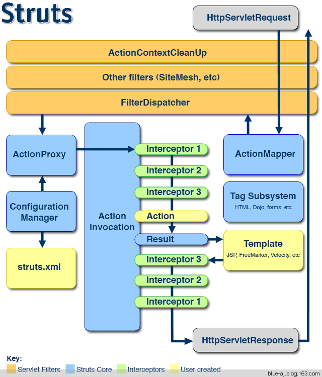

## Struts 2基础

####1.Struts 2 基本组成

* Xwork 部分: 与Web无关的部分，与Servlet无关的部分，比如用户数据的类型转换、动作调用之前的数据验证、动作的调用等。
* Struts 2 部分：与Web相关的部分，也就是与servlet相关的部分。

####2.Struts 2 作用
除了提供MVC基本的功能，还提供了：

* Struts 2提供内存式的数据中心，所有可供访问的数据都集中存放在内存中，所以在调用中不需要将数据传来传去，只要去这个内存数据中心访问即可。

####3.Struts 2的架构图

* 橙色的是Servlet Filters,过滤器链。
* 蓝色的是Struts Core，核心部分。
* 浅绿色是Interceptors，Struts 2的拦截器。
* 浅黄色的User Created，由开发人员创建的，包括struts.xml, Action, Template。

各个部分的作用：

* FilterDispatcher是整个Struts 2的核心，根据ActionMapper的结果来决定是否处理请求，如果ActionMapper指出该URL应该被Struts 2处理，那么它将会执行Action处理。
* ActionMapper提供了HTTP请求与action执行之间的映射。
* ActionProxy是一个特别的中间层，位于Action和xwork之间。
* ConfigurationManager是xwork配置的管理中心。
* struts.xml是Struts 2的应用配置文件。
* ActionInvocation：真正调用并执行Action，它拥有一个Action实例和这个Action所依赖的拦截器实例。ActionInvocation执行这些拦截器、Action以及相应的Result。
* Inteceptor:拦截器是一些无状态的类，可以自动拦截Action.
* Action:动作类是Struts 2中的动作执行单元。
* Result:Result就是不同视图类型的抽象封装模型，不同的视图类型会对应不同的Result实现。
* Templates:各种视图类型的页面模板。
* Tag Subsystem:Struts的标签库，抽象了三种不同的视图技术。